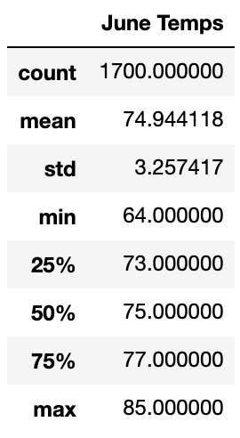
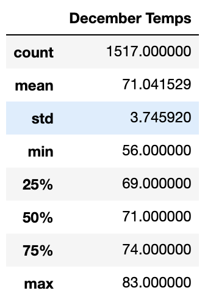

# Surfs Up!

## Project Overview
Analysis and data exploration of climate database using Python, SQLAlchemy, and Flask. Determining the best time of the year to open ice cream and surf shops in Hawaii. 

## Results
### Deliverable 1:

* The average temperature in Hawaii in June was 74.94 degrees. 
* The minimum temperature in Hawaii in June was 64 degrees.
* The maximum temperature in Hawaii in June was 85 degrees.

### Deliverable 2:

* The average temperature in Hawaii in December was 71.04 degrees. 
* The minimum temperature in Hawaii in December was 56 degrees.
* The maximum temperature in Hawaii in December was 83 degrees.

## Summary
Even though June and December are six months apart, the maximum temperatures are very close to one another, 85 and 83 degrees respectively. The average and minimum temperatures in June were higher than those in December. Looking at the quartiles for the temperatures in June, the interquartile range is 4, and the standard deviation is 3.25, which are close to each other, indicating that our average of 74.9 is an accurate value given the spread of values of each quartile. This indicates that ice cream and surf shops will be successful during June, as it tends to be warm throughout the entire month. The interquartile range for the December temperatures is 5, which is close to the standard deviation of 3.74, but not as close as it was for June temperatures. This inidcates that there could be some variation within temperatures during the month of December, especially with a minimum temperature of 56 degrees and a maximum of 83 degrees. Thus, December could have differing temperatures that would lead to a fluctuation in popularity of ice cream and surf shops. 

I would perform the following two queries to further my analysis for June and December: 
1. A query to retrieve the precipitation data from each month.
2. A query to retrieve the station data for each month.
